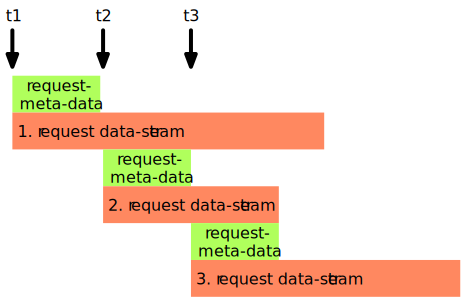

Overview
image:doc/images/Overview.svg[Overview]

Process Separation
image:doc/images/ProcessSeparation.svg[ProcessSeparation]

Channel timing

As you can see the 2nd. request starts before
the whole stream of the 1st. request is completely processed

Endpoint attributes as defined by the implementation

- name
- description
- mandatory
  * _true_ endpoint must be connected - default value
  * _false_ endpoint my be connected

- direction one of
  * _in_ input only requests can only bes send
  * _out_ output only requests only come in
  * _inout_ bi directional request are beeing send and come back
- uti  see https://en.wikipedia.org/wiki/Uniform_Type_Identifier
- contentInfo meta attributes provided from the content origin as file names,...

[source,javascript]
----
"the-step-name": {
  "description": "copies incoming (in) requests into output (out)",
  "endpoints": {
    "in": {
      "direction": "in"
      "contentInfo" : {
        "name" : {
          "description" : "required name of the content",
          "mandatory" : true
        },
        "encoding" : {
          "description" : "char set encoding",
          "mandatory" : true,
          "defaultValue" : "utf-8"
        }
      }
    },
    "out": {
      "direction": "out"
    }
  },
  "config" : {
      "attribute1" : {
        "description" : "char set encoding",
        "mandatory" : true,
        "defaultValue" : "utf-8"
      }
  },
  "initialize": function (manager, step) {
    // ... code comes here ...

    step.meta.config.attribute1;
    step.meta.endpoints.in.contentInfo.encoding.defaultValue;

    let input = step.endpoints.in();
  }
----
