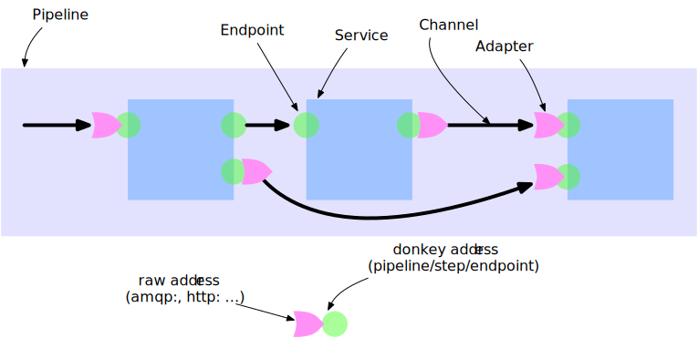

Overview

[source,json]
----
{
"name": "myFlow",
"steps": {
  "s1": {
    "type": "copy",
    "config": {
      "port": 77
    },
    "endpoints": {
      "in": "stdin",
      "out": "step:s2/in"
    }
  },
  "s2": {
    "type": "copy",
    "endpoints": {
      "out": "file:/tmp/sample1.txt"
    }
  }
}
}
----

Endpoint attributes

- name
- description
- mandatory defaults to true
- direction one of
  * in input only requests can only bes send
  * out output only requsts only come in
  * inout bi directional request arebeeing sand and come back
- uti  see https://en.wikipedia.org/wiki/Uniform_Type_Identifier
