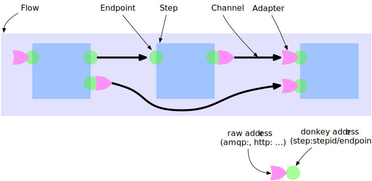

Overview

Channel timing

As you can see the 2nd. request starts before
the whole stream of the 1st. request is completely processed

Sample flow definition
[source,json]
----
{
"name": "myFlow",
"steps": {
  "s1": {
    "type": "copy",
    "config": {
      "port": 77
    },
    "endpoints": {
      "in": "stdin",
      "out": "step:s2/in"
    }
  },
  "s2": {
    "type": "copy",
    "endpoints": {
      "out": "file:/tmp/sample1.txt"
    }
  }
}
}
----

Endpoint attributes as defined by the implementation

- name
- description
- mandatory
  * _true_ endpoint must be connected - default value
  * _false_ endpoint my be connected

- direction one of
  * _in_ input only requests can only bes send
  * _out_ output only requsts only come in
  * _inout_ bi directional request arebeeing sand and come back
- uti  see https://en.wikipedia.org/wiki/Uniform_Type_Identifier
- contentInfo meta attributes provided from the content origin as file names,...

[source,json]
----
"the-step-name": {
  "description": "copies incoming (in) requests into output (out)",
  "endpoints": {
    "in": {
      "direction": "in"
      "contentInfo" : {
        "name" : {
          "description" : "required name of the content",
          "mandatory" : true
        },
        "encoding" : {
          "description" : "char set encoding",
          "mandatory" : true,
          "defaultValue" : "utf-8"
        }
      }
    },
    "out": {
      "direction": "out"
    }
  },
  "initialize": function (manager, step) {
    ... code comes here ...
  }
----
