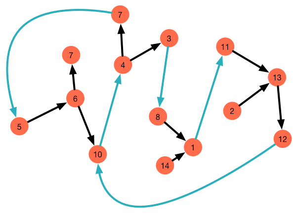
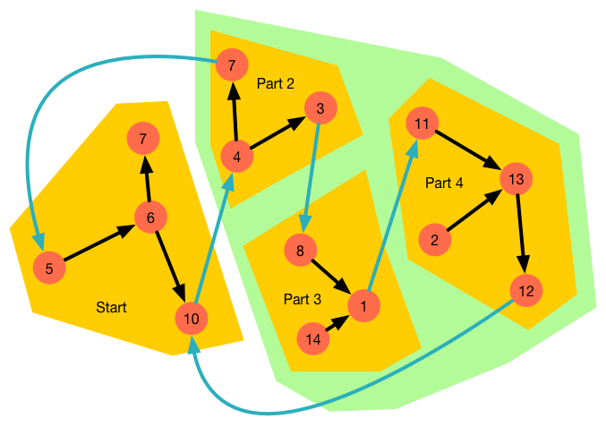

== Darüber müssen wir reden

Im ersten Bild sehen wir einen Flow der viele verbindungen hat.

.Ein Beispiel Flow

Im nächsten Bild ist zu sehen wie dieser in Gruppen aufgeteilt wurde.

.Flow in Gruppen aufgeteilt
image::images/flow_group_2.png[]

So und jetzt wird es spannend.

Problem 1::
Woran erkennen wir welche Gruppe die Startgruppe ist. +
ich denke wir müssen das dem Flow mitteilen.

.Ein Beispiel Flow

Den grünen Bereich einfach erst mal ignorieren.
 +
 + 

Im Diesem Bild haben wir die Parts und die Reihenfolge.
Aber auch hier stellen sich ein paar Probleme. Denn ich als Flow designer
weis was ich mit dem Flow erreichen will, aber Kronos weis es nicht.

Folgen ideen stecken in diesem Flow:

* Part 1 (Start) pollt ein verzechniss und speichert die Daten in eine DB.

* Part 2 ist ein langwieriger prozess, dieser sollte in möglichst
vielen instanzen parallel ausgeführt werden.

* Part 3 wiederum muss viele Daten im Ram halten umd einen gewissen Daten abgleich zu machen,
dieser geht aber sehr schnell, so das alle request sinvoller Weise über nur eine Instanz
gerouted werden sollten.

* Part 4 dauert wieder länger, hier wären mehrer Instanzen sinnvoll.
