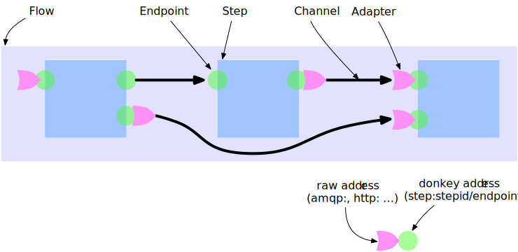
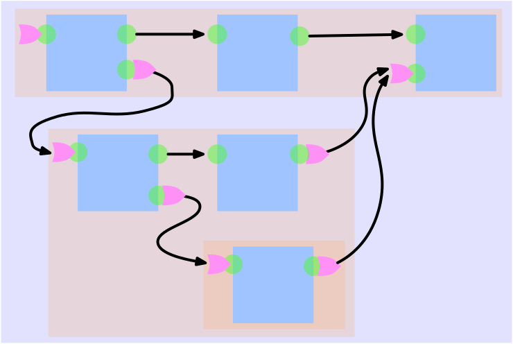

== Flow

Overview

Process Separation

The flow defines how the steps are connected to each other and which steps will participate in this flow.

=== Flow definition

.Sample flow definition
[source,json]
--------------------------------------------
{
 "myFlow" : {                <1>
   "steps": {
     "s1": {                 <2>
       "type": "copy",
       "config": {           <3>
         "port": 77
       },
       "endpoints": {        <4>
         "in": "stdin",
         "out": "step:s2/in"
       }
     },
     "s2": {
       "type": "copy",       <5>
       "endpoints": {
         "out": "file:/tmp/sample1.txt"
       }
     },
     "s3": {
       "endpoints": {
         "in": "step:steps/s1/in",  <6>
         "out": "step:steps/s2/out"
       },
      "steps": {
         "s1": {
           "endpoints": {
             "out": "step:s2/in"
           },
           "type": "copy"
         },
         "s2": {
           "type": "copy"
         }
       }
     }
   }
 }
}
--------------------------------------------
<1> The name of the flow
<2> The name of the step in this flow
<3> A configuration for this step
<4> The endpoints of this step by name. A step may have as much endpoints as needed.
<5> the reference to the step implementation. This is the name under the step is registered
<6> mapping connection from outer to inner world

=== Flow Source

[source,js]
/**
 * anonymous function - Creates flows from the JSON object
 *
 * @param  {object} flowDefinitions The Json object describing the flows
 * @param  {object} pr              The progress reporter
 * @return {array}                  The created flows
 */
exports.create = function (flowDefinitions, pr) {...}
