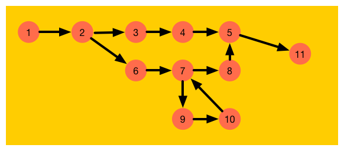
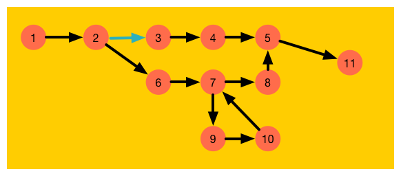
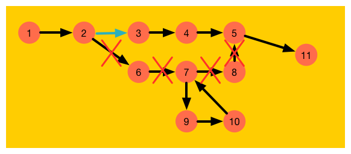
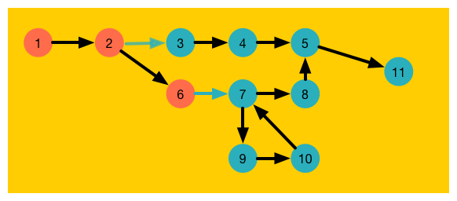
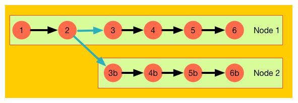
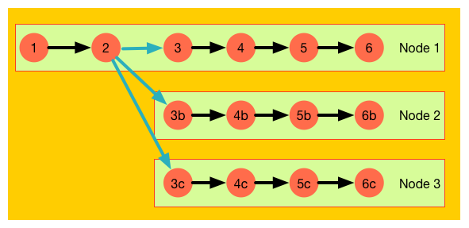
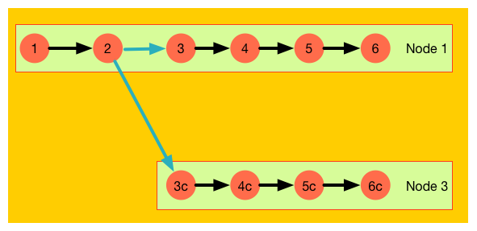
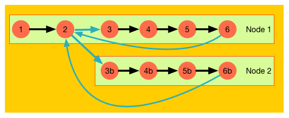

== Service Manager

The service manager is the heart of the framework.

=== Initialize a flow

. Check that the all the referenced steps are existing. Each step referenced in a flow must
be registered before at the service manager.
. Check that all the channels exists. If the connection between two steps is not a default channel
it needs to be tested that the referenced channel exists.
. If there is a special channel used the flow needs to be restructured. All the steps devided
by a special channel build a step group. These groups may be transfered to other node servers.
It needs to be checked that these groupd do not have default connection to the other groups.

The following picture will show an example flow which will start with the step ''1''
and ends with the step ''11''. In this case only the default channels (the black errows) are used.
There is nothing special to do.

.example flow

The next example shows the same flow but the channel connection step ''2'' with step ''3'' is a
special channel. Lets assume this is a round robin channel which distributes the requests to
multiple other nodes via http.

.example flow

So the steps needs to be divided into two groups. But it could not be done as schown in the
next picture.

.example flow

The processor could not find a clear edge where the first group end ant the second group starts.
Therefore it is mandatory that all steps of a group which should/could be divided needs to be connected
with special channel. So the flow processor could separate the groups. This is shown in the next
picture.

.example flow

The steps ''1'', ''2'' and ''6'' build one group and the rest the second group.

=== Life cycle of a flow
Now we have a look on the life cycle of a flow. Lets assume we have a flow with six steps. Step
''2'' is connected to step ''3'' with a special round robin channel for distributing requests
to other nodes.

In our example the steps have the following function (only for a better understanding):

Step 1:: Reads a file directory and creates a file list. The step polls this directory every hour
and returns the list of all the new files.

Step 2:: Iterates the file list comming from Step 1 does and magic and if the step decides the file
should be processed, it will send the request to step 3.

Step 3:: Reads the file comming from the stream and parses it (Maybe a CSV parser). Then for each line
it will call the next step for processing the line.

Step 4:: Do some processing and any other useful things.

Step 5:: What ever it will do.

Step 6:: Writes the result to a database.

Now this wonderful flow will be loaded into the service manager. The flow will be checked and all seems
to look right. The flow will be divided into two step groups because of the special channel.
The service manager will look for available nodes but there is no other node. So the complete flow
will be executed on the same node.

*TODO: @Markus lass uns hierüber noch mal sprechen.*
In this case the chanel connectin the step 2 with step 3 will be
the direct channel wich is the default one.

The flow will look like shown in the next picture.

.example flow

While executing the flow (There are thounds of new files and the execution will take some time) a new
node will become available. Now the manager registers the second step group on this new node and will distribute
the requests to both nodes. The own one and the remote one (remote in this case means other running node instance).

.example flow

And as lucka as we are we will get a third node to help us. Also this node will be included into
our flow.

.example flow

But thinks not always work as expected, node 2 disappears. The service manager will notice this and
excludes node 2.

.example flow

So far so good, but as node 2 disappears we have no glue what has happend on node 2. This throws
a list of questions to us:
- Was the request finnished successfully?
- What was the last request send to this node?
- Do we need to reprocess the file again?
- Which file was lost?

Maybe the server where crashed, or only the network between these two servers where disruped, but
node 2 could finish his work. Should node two save the result into the database?

How could kronos solve these issues? There is a good and a bad answers. The bad one is:
Kronos could not solve this by its onw. The good one is: It could be done in the steps.

=== Handling service disruption
This chaper tries to show how to build flows which could handle service disruption. So it is
possible to start up und shutdown any server without any data loss. This works for all but the
first node which initializes the complete flow and distributes the requests.

The next picture shows the same flow as in the last chapter which some enhancements.

.example flow

It is the same flow but with two enhancements:

Step 2::
The Step 2 does the same as before, but it will generate an id for each request and will store the
requests before it will send them out.

Step 6::
The step will send a message back to step 2 before it will commit the change to the database. So
if the connection will be broken between node 2 and node 1 the data will not be commited.

As step 2 gets a success message for a request from step 6 it could delete this request from its registry.
So it knows which request was successfully done. After no more files should be processed it could
resend all the requests which where not successfuly done.
